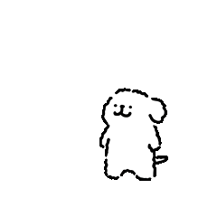
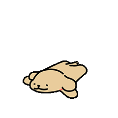
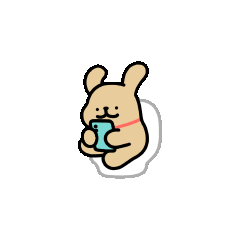

# 幸福是一只小狗～


一个基于 Electron 的桌面萌宠。小狗会悬浮在桌面上，根据鼠标、键盘、时间和软件状态播放不同动画，也可以拖动、缩放和设置开机自启动。检测到音乐播放时，会将两段音乐动画各循环 9.6 秒后交替播放。

当前 Windows 版本为 **V.2.1.1**。

## 下载


[下载最新版 Windows 10 / 11 安装包（V2.1.1）](https://github.com/remake1026/desktop-pets/releases/download/V.2.1.1/line.puppy-2.1.1-win10-11-set.up.exe)

[macOS Apple Silicon（M1 / M2 / M3 / M4）下载 line puppy](https://github.com/remake1026/desktop-pets/releases/tag/v1.2.2-mac)

注意！！mac版本Command+S 会覆盖软件原本的保存功能！需要关闭桌宠程序才可恢复！！（修复中)


## 互动展示

### 鼠标部分

| 默认 | 鼠标悬停 | 鼠标点击 | 鼠标拖拽 | 滚动滚轮 |
| :---: | :---: | :---: | :---: | :---: |
|  |  |  |  |  |
| 不操作时安静睡陪伴 | 指针移到小狗身上时跳跃 | 左键点击时播放爱心动画 | 按住左键拖动小狗到新位置 | Windows 中滚动鼠标滚轮时播放滚动动画 |

### 键盘部分

| Enter | Ctrl + S | Ctrl + Z | Delete / Backspace |
| :---: | :---: | :---: | :---: |
|  |  |  |  |
| 按下 Enter 或小键盘 Enter 时播放发送动画 | 按下 Ctrl+S 时播放两次保存成功动画 | 按下 Ctrl+Z 时播放一次撤销动画 | 按下 Delete、小键盘 Delete 或 Backspace 时播放删除动画 |

Windows 支持全局键盘互动，切换到其他软件后仍能响应；macOS 支持 Command+S、Command+Z、Return、小键盘 Enter、Delete 和 Fn+Delete 的对应动画。macOS 首次使用全局输入监听时，可能需要在系统“隐私与安全性”中授予输入监控权限；原生监听程序不可用时仍保留 Command+S 的备用触发。

### 定时部分

| 用餐时间 | 充电时间 | 充电时间 | 下班时间 |
| :---: | :---: | :---: | :---: |
|  |  |  |  |
| 每天 09:30–10:10、12:00–13:00、20:00–21:00<br>播放用餐动画 | 每天 05:20 和 17:20<br>播放 520 动画 | 每天 05:21 和 17:21<br>播放 521 动画 | 每天 18:00–19:00<br>提示该下班了 |

| 熬夜时间 | 睡觉时间 | 小白拉屎 | 小鸡毛拉屎 |
| :---: | :---: | :---: | :---: |
|  |  |  |  |
| 每天 23:00–24:00<br>深夜进入困倦状态 | 每天 00:00–02:00<br>凌晨小狗趴下熟睡 | 每天 10:30–10:40<br>固定拉屎 | 每天 10:40–10:50<br>固定拉屎 |

定时互动按电脑的本地时间自动触发。

### 软件部分

| 启动软件 | 播放音乐 | 任务完成 |
| :---: | :---: | :---: |
|  |   |  |
| 每次启动时播放开场动画。 | Windows 检测到受支持的音乐软件正在播放时自动切换，并在两段音乐素材间轮播。 | 使用 `--task-complete` 参数触发庆祝动画。 |

音乐互动支持 QQ 音乐、网易云音乐、酷狗音乐、iTunes 和 Apple Music；播放时 `music.gif` 循环 6 次（1.6 秒/次），`music-dance.gif` 循环 5 次（1.92 秒/次），两组各为 9.6 秒后交替循环。暂停或停止音乐后恢复当前时段应显示的状态；鼠标悬浮可临时覆盖音乐动画，移开后若音乐仍在播放会立即恢复音乐动画。

### 播放与打断规则

- 启动动画及 5:20 / 17:20 的 520、5:21 / 17:21 的 521 动画为锁定动画，播放期间不会被其它交互打断。
- 用餐、上午拉屎、喝水、下班、困倦和趴睡属于可恢复时段动画；可被悬浮、音乐、点击、键盘、滚轮、拖拽和任务完成临时覆盖，交互结束后若时段仍有效则恢复。
- 悬浮可临时覆盖普通时段和音乐动画；鼠标移开后优先恢复仍在播放的音乐，否则恢复当前有效时段或默认状态。

## 功能

- 透明悬浮：无边框、透明背景、始终置顶，不占用任务栏位置
- 鼠标互动：悬停、点击、拖拽和滚轮触发不同动画
- 键盘互动：Windows 全局响应 Enter、Ctrl+S、Ctrl+Z、Delete 和 Backspace；macOS 对应 Command+S、Command+Z、Return、Delete / Fn+Delete
- 定时互动：按本地时间自动切换用餐、上午互动、下班时间、520、521、困倦和熟睡状态；520 / 521 为不可打断的锁定动画，其余时段素材可被悬停、音乐及其它互动临时覆盖，互动结束后恢复该时段素材
- 音乐互动：Windows 播放受支持的音乐软件时自动切换动画
- 自由调整：拖动小狗移动位置，拖动右下角旋钮调整大小
- 系统托盘：可切换开机自启动、清除缓存并退出程序
- 任务反馈：支持通过启动参数播放任务完成动画
- 单实例运行：重复启动时唤醒已有窗口
- Windows 安装：一个安装包同时包含 32 位和 64 位版本，可选择安装位置、桌面快捷方式和开机自启动
- macOS 适配：支持 Apple Silicon、透明置顶、空白区域点击穿透和菜单栏控制

## 安装教程

### Windows 10 / 11

安装包已包含运行环境，无需安装 Node.js，安装时无需联网。

| 最新安装包 | 系统 | 架构 |
| --- | --- | --- |
| [line puppy V2.1.1](https://github.com/remake1026/desktop-pets/releases/download/V.2.1.1/line.puppy-2.1.1-win10-11-set.up.exe)（约 182 MB） | Windows 10、Windows 11 | 自动选择 x86 / x64 |

1. 下载并双击安装包；旧版正在运行时，请先从托盘菜单退出。
2. 选择安装范围和安装位置，再选择是否创建桌面快捷方式、是否开机自启动。
3. 点击“安装”，完成后启动 **line puppy**。

安装包暂未进行代码签名。如果 Windows 显示保护提示，请点击“更多信息”后选择“仍要运行”。卸载时可在 Windows“已安装的应用”中找到 **line puppy**。

### macOS（Apple Silicon）

macOS 当前版本为 v1.2.2，仅支持 Apple Silicon（M 系列芯片）Mac，系统要求 macOS 12 Monterey 或更新。

注意！！mac版本Command+S 会覆盖软件原本的保存功能！需要关闭桌宠程序才可恢复！！（修复中)
使用 Homebrew：

```bash
brew tap remake1026/desktop-pets https://github.com/remake1026/desktop-pets.git
brew install --cask line-dog
```

也可以[下载 DMG](https://github.com/remake1026/desktop-pets/releases/download/v1.2.2-mac/line.puppy-1.2.2-Mac-arm64.dmg)，打开后将应用拖入 **Applications**。首次打开若提示无法验证开发者，请按住 Control 点击应用并选择“打开”，或执行：

```bash
xattr -cr "/Applications/line puppy.app"
```

### 从源码运行

先安装 Node.js，然后在项目目录执行：

```bash
cd 源码
npm install
npm start
```

也可以在 Windows 双击 `启动桌宠.cmd`，或在 macOS 双击 `启动桌宠.command`。

## 触发任务完成动画

Windows 安装版：

```powershell
& "D:\line puppy\line puppy.exe" --task-complete
```

源码运行：

```bash
cd 源码
npm run task-complete
```

macOS 安装版：

```bash
"/Applications/line puppy.app/Contents/MacOS/line puppy" --task-complete
```

## 常见问题

### 桌宠没有出现

- 查看系统托盘或后台是否已经运行了一个实例
- 从托盘退出后重新启动
- 从源码运行时，在 `源码` 目录执行 `npm start` 查看错误信息

### 怎么关闭桌宠

点击系统托盘图标并选择“退出”。也可以右键点击小狗，再点击出现的关闭按钮。

### macOS 提示无法验证开发者

Mac 包尚未 Apple 公证。按住 Control 点击应用并选择“打开”，或执行 `xattr -cr "/Applications/line puppy.app"` 后重新启动。

## 开发说明

### 构建 Windows 安装包

在 Windows 的 `源码` 目录执行：

```powershell
npm ci
npm run dist:win
```

安装包输出到 `dist/standard/`，同时包含 x86 和 x64 版本。

### 构建 macOS 安装包

在 Apple Silicon Mac 的 `源码` 目录执行：

```bash
npm ci
npm run dist:mac
```

产物输出到 `dist/standard/`。发布新版 Mac 包后，还需要更新 `Casks/line-dog.rb` 中的版本和 SHA-256。

## 关于素材与版权

这个项目是出于对「线条小狗」的喜爱，以及学习和交流桌面应用开发的目的制作的。

项目中使用的相关图片和 GIF 动画来自网络流传的表情包，目前尚未获得原作者或相关权利人的授权，素材版权归各自权利人所有。本项目并非官方作品，也与原作者不存在合作或授权关系。

欢迎交流代码和实现思路，但仓库公开并不代表其中的表情包素材可以自由使用。请勿将这些素材用于商业用途；如需在其他项目中使用或传播，请先确认并取得相关授权。

如果您是相关素材的权利人，觉得这里的使用不合适，请通过 [Issues](https://github.com/remake1026/desktop-pets/issues) 联系我，我会及时处理、删除或替换相关素材。

感谢原作者带来这么可爱的作品，也希望大家一起尊重创作、支持正版。
